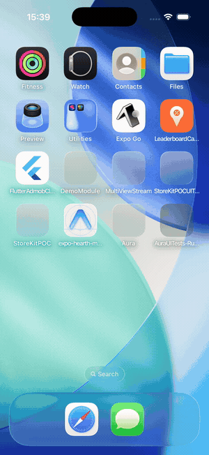
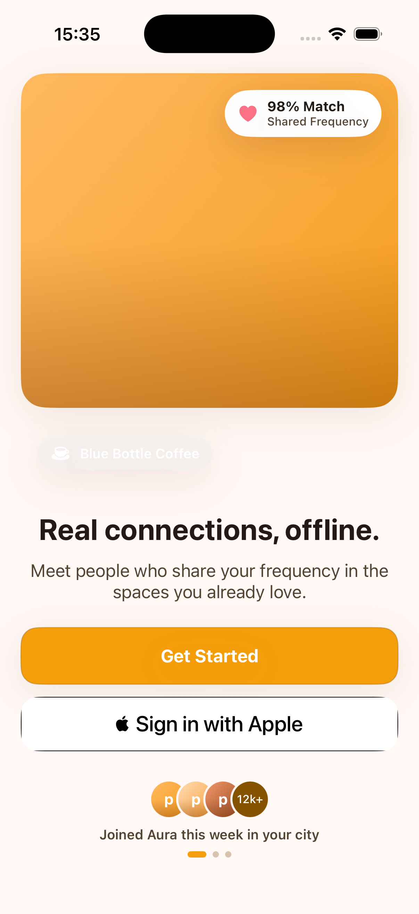
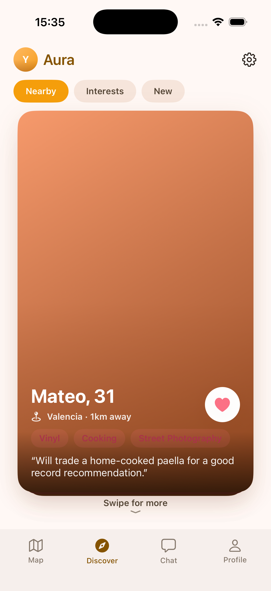
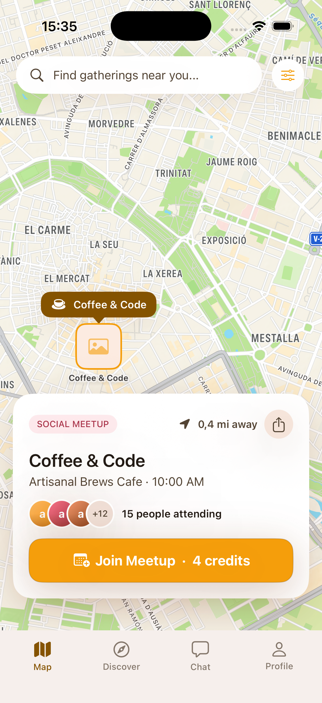
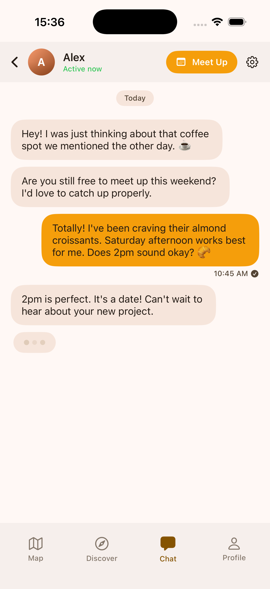
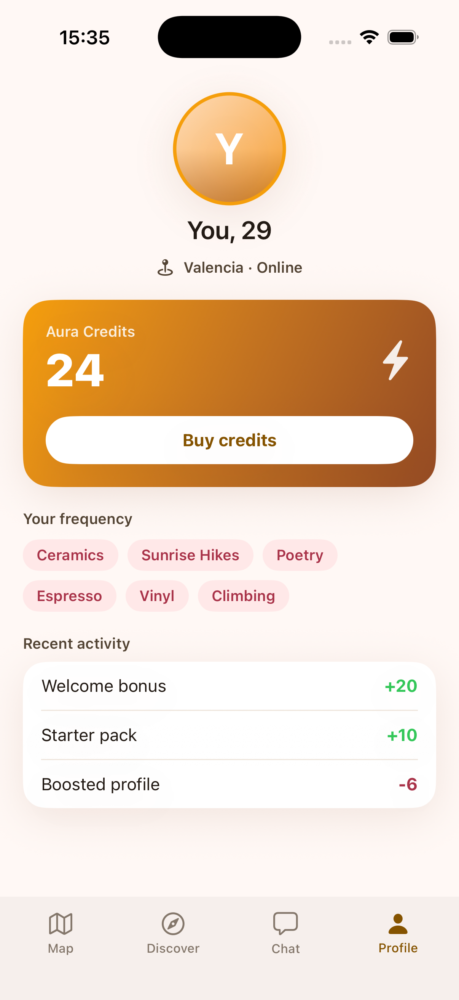
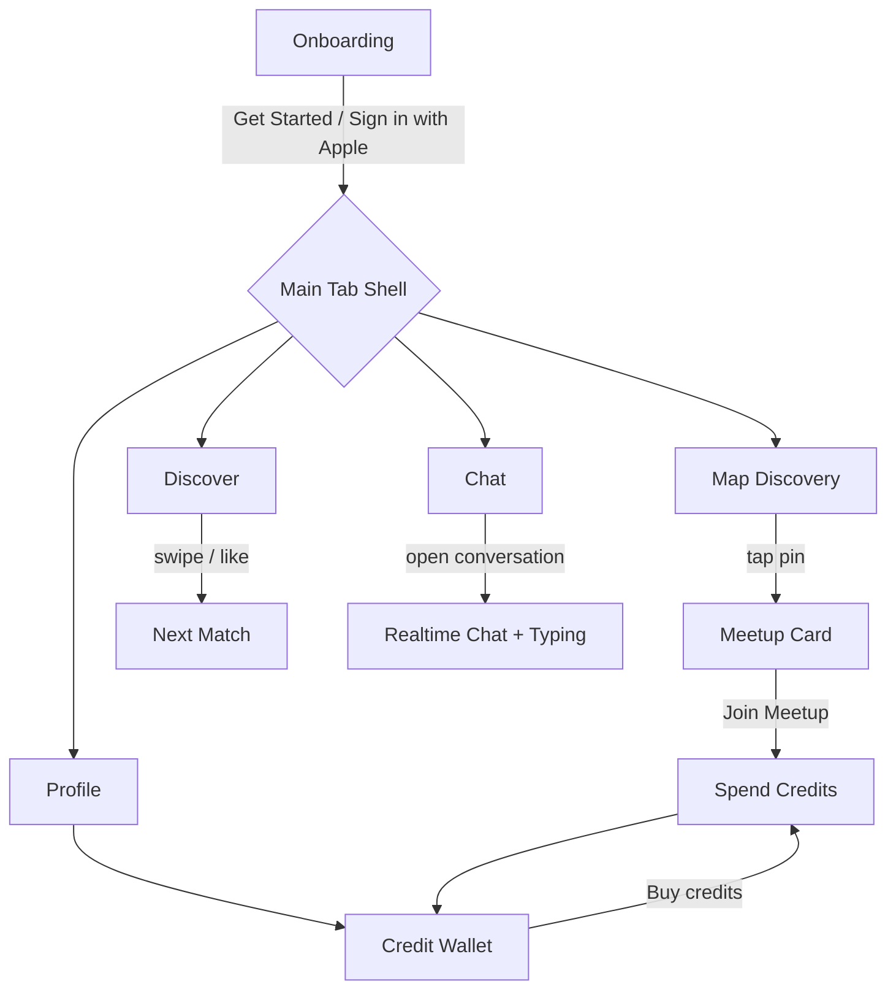

# Aura - Interest-Based Social Discovery (iOS, SwiftUI)

Native iOS app for meeting people who share your interests, in real-world spaces
near you. Onboarding, a swipeable matching/discovery flow, map-based meetup
discovery, real-time chat, time-sensitive meetups, and an in-app credit economy -
all built in **Swift + SwiftUI** against a mock backend, design-first from a
Google Stitch design system ("Aura Radiant", golden-hour warmth).

<p align="center">
  
</p>

## Screens

| Onboarding | Discover | Map |
|---|---|---|
|  |  |  |

| Chat | Profile / Credits |
|---|---|
|  |  |

## What it shows

- **Onboarding + Sign in with Apple** - warm hero, "shared frequency" match badge,
  social proof, real `SignInWithAppleButton` (StoreKit/AuthenticationServices).
- **Discover** - draggable card stack with rotation, like/pass stamps, spring
  snap-back, and segmented feed (Nearby / Interests / New) ranked like a
  recommendation service.
- **Map discovery** - `MapKit` map with custom meetup pins, a selected-pin callout,
  and a bottom meetup card (attendees, distance, time).
- **Time-sensitive meetups + credits** - "Join Meetup" reserves a spot and spends
  in-app credits; a credit store sheet tops up the wallet (StoreKit-style economy).
- **Real-time chat** - conversation with sent/received bubbles, presence
  ("Active now"), animated typing indicator, and a composer.
- **Profile** - credit wallet, interest "frequency" chips, and a credit ledger.

Everything runs on the simulator with **no network, keys, or hardware** - the
backend in the brief (Node/TypeScript + PostgreSQL with PostGIS geo and pgvector
recommendations, WebSocket realtime, APNs push, StoreKit credits) is stubbed by an
in-memory `MockBackend` so each feature is fully demoable.

## Architecture

- **Swift + SwiftUI**, iOS 17+, `@Observable` state, `NavigationStack`, `MapKit`.
- Single source of truth: `MockBackend` (`@Observable @MainActor`) injected via
  `.environment(...)` - models the backend's API surface (discovery feed, nearby
  meetups, conversations, credit wallet) with optimistic mutations.
- Design system ported 1:1 from the Stitch tokens in `design/DESIGN.md`
  (`AuraColor`, `AuraFont`, warm amber ambient shadows).
- Feature-first folders: `Onboarding`, `Discover`, `Map`, `Chat`, `Profile`, with
  a custom floating `AuraTabBar` shell.

```
Aura/
  App/        AuraApp, AppFlow (routing + launch-arg deep links)
  Theme/      AuraColor, AuraFont, shadows (from design/DESIGN.md)
  Models/     Profile, Meetup, Conversation, ChatMessage, credits
  Services/   MockBackend (stubs Node/Postgres/WebSocket/StoreKit)
  Features/   Onboarding, Discover, Map, Chat, Profile, Root
  Components/  PhotoView, AvatarView, InterestChip, PrimaryButton
```

## App flow



## Run

```bash
xcodegen generate        # generates Aura.xcodeproj from project.yml
open Aura.xcodeproj       # ⌘R on an iPhone 17 Pro simulator
```

Requires Xcode 26+. No third-party dependencies.
