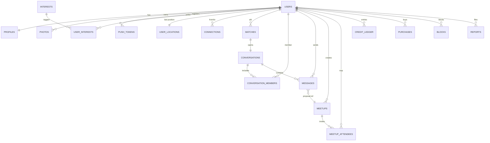
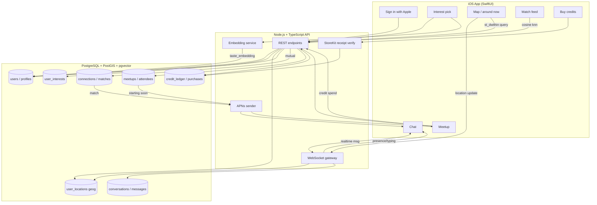

# Database Design - Social Connection App

Postgres 15 + **PostGIS** (geo) + **pgvector** (taste embeddings). Covers all 42 screens / 6 features: auth, interests/matching, presence/map, chat, meetups, credits, safety.

> Note: founder says a schema is already specced. This is my proposed model to align against - call out deltas on the first call.

---

## 1. Extensions

```sql
create extension if not exists postgis;     -- geography type, spatial index
create extension if not exists vector;      -- pgvector for taste embeddings
create extension if not exists pgcrypto;    -- gen_random_uuid()
```

---

## 2. Entities (DDL)

### Users + auth

```sql
create table users (
  id              uuid primary key default gen_random_uuid(),
  apple_user_id   text unique not null,          -- Sign in with Apple subject
  email           text,                          -- may be private-relay
  created_at      timestamptz not null default now(),
  deleted_at      timestamptz,                   -- soft delete (App Store req)
  last_active_at  timestamptz
);

create table push_tokens (
  id          uuid primary key default gen_random_uuid(),
  user_id     uuid not null references users(id) on delete cascade,
  apns_token  text not null,
  environment text not null default 'production',  -- sandbox|production
  updated_at  timestamptz not null default now(),
  unique (user_id, apns_token)
);
```

### Profiles + interests + taste vector

```sql
create table profiles (
  user_id        uuid primary key references users(id) on delete cascade,
  display_name   text not null,
  bio            text,
  birthdate      date,
  -- taste embedding for pgvector similarity (e.g. 768-dim)
  taste_embedding vector(768),
  -- discoverability + privacy
  is_discoverable boolean not null default true,
  location_precision text not null default 'approximate', -- precise|approximate|off
  updated_at     timestamptz not null default now()
);
create index on profiles using ivfflat (taste_embedding vector_cosine_ops) with (lists = 100);

create table photos (
  id        uuid primary key default gen_random_uuid(),
  user_id   uuid not null references users(id) on delete cascade,
  url       text not null,
  position  int not null default 0,        -- ordering; 0 = primary
  created_at timestamptz not null default now()
);

create table interests (
  id    uuid primary key default gen_random_uuid(),
  slug  text unique not null,              -- 'film-photography'
  label text not null
);

create table user_interests (
  user_id     uuid references users(id) on delete cascade,
  interest_id uuid references interests(id) on delete cascade,
  primary key (user_id, interest_id)
);
```

### Presence + location (map / "around now")

```sql
-- latest known position per user; updated on app foreground / move
create table user_locations (
  user_id    uuid primary key references users(id) on delete cascade,
  geog       geography(point, 4326) not null,   -- PostGIS point (lon/lat)
  is_live     boolean not null default false,   -- "around now" toggle
  updated_at timestamptz not null default now()
);
create index user_locations_geog_idx on user_locations using gist (geog);
create index user_locations_live_idx on user_locations (is_live) where is_live;
```

### Connections / matching

```sql
-- one row per directed like; mutual = match
create table connections (
  id          uuid primary key default gen_random_uuid(),
  from_user   uuid not null references users(id) on delete cascade,
  to_user     uuid not null references users(id) on delete cascade,
  status      text not null default 'pending',  -- pending|accepted|passed
  created_at  timestamptz not null default now(),
  unique (from_user, to_user),
  check (from_user <> to_user)
);
create index on connections (to_user, status);

-- materialized match when both sides accept (a<b canonical ordering)
create table matches (
  id          uuid primary key default gen_random_uuid(),
  user_a      uuid not null references users(id) on delete cascade,
  user_b      uuid not null references users(id) on delete cascade,
  created_at  timestamptz not null default now(),
  unique (user_a, user_b),
  check (user_a < user_b)
);
```

### Chat (real-time)

```sql
create table conversations (
  id          uuid primary key default gen_random_uuid(),
  match_id    uuid unique references matches(id) on delete cascade,
  created_at  timestamptz not null default now(),
  last_msg_at timestamptz
);

create table conversation_members (
  conversation_id uuid references conversations(id) on delete cascade,
  user_id         uuid references users(id) on delete cascade,
  last_read_at    timestamptz,
  primary key (conversation_id, user_id)
);

create table messages (
  id              uuid primary key default gen_random_uuid(),
  conversation_id uuid not null references conversations(id) on delete cascade,
  sender_id       uuid not null references users(id) on delete cascade,
  body            text,
  kind            text not null default 'text',  -- text|meetup_proposal|system
  meetup_id       uuid references meetups(id),    -- set when kind=meetup_proposal
  created_at      timestamptz not null default now()
);
create index on messages (conversation_id, created_at desc);
```

### Meetups (time-sensitive)

```sql
create table meetups (
  id            uuid primary key default gen_random_uuid(),
  creator_id    uuid not null references users(id) on delete cascade,
  title         text,
  place_geog    geography(point, 4326) not null,
  place_label   text,
  window_start  timestamptz not null,
  window_end    timestamptz not null,
  status        text not null default 'proposed', -- proposed|confirmed|live|done|expired|cancelled
  credit_cost   int not null default 0,
  created_at    timestamptz not null default now()
);
create index meetups_geog_idx on meetups using gist (place_geog);
create index on meetups (status, window_end);

create table meetup_attendees (
  meetup_id   uuid references meetups(id) on delete cascade,
  user_id     uuid references users(id) on delete cascade,
  rsvp        text not null default 'invited',  -- invited|going|declined
  checked_in_at timestamptz,                     -- "I'm here"
  primary key (meetup_id, user_id)
);
```

### Credits + in-app purchase (StoreKit)

```sql
-- running balance is sum of ledger; ledger is source of truth
create table credit_ledger (
  id          uuid primary key default gen_random_uuid(),
  user_id     uuid not null references users(id) on delete cascade,
  delta       int not null,                  -- +purchase, -spend
  reason      text not null,                 -- purchase|meetup|boost|refund|grant
  ref_id      uuid,                          -- meetup_id / purchase_id
  created_at  timestamptz not null default now()
);
create index on credit_ledger (user_id, created_at desc);

create table purchases (
  id                 uuid primary key default gen_random_uuid(),
  user_id            uuid not null references users(id) on delete cascade,
  product_id         text not null,          -- StoreKit product
  transaction_id     text unique not null,   -- Apple original_transaction_id
  credits_granted    int not null,
  verified_at        timestamptz,            -- server-side receipt validation
  created_at         timestamptz not null default now()
);
```

### Safety (block / report)

```sql
create table blocks (
  blocker_id  uuid references users(id) on delete cascade,
  blocked_id  uuid references users(id) on delete cascade,
  created_at  timestamptz not null default now(),
  primary key (blocker_id, blocked_id),
  check (blocker_id <> blocked_id)
);

create table reports (
  id          uuid primary key default gen_random_uuid(),
  reporter_id uuid not null references users(id) on delete cascade,
  target_user uuid references users(id) on delete set null,
  reason      text not null,
  note        text,
  status      text not null default 'open',   -- open|reviewed|actioned
  created_at  timestamptz not null default now()
);
```

---

## 3. Key queries

**Matching feed (taste similarity + not seen + not blocked):**
```sql
select p.user_id, p.display_name,
       p.taste_embedding <=> $me_embedding as distance   -- cosine
from profiles p
where p.is_discoverable
  and p.user_id <> $me
  and p.user_id not in (select to_user from connections where from_user = $me)
  and p.user_id not in (select blocked_id from blocks where blocker_id = $me)
order by p.taste_embedding <=> $me_embedding
limit 20;
```

**Around now (live users within radius, nearest first):**
```sql
select l.user_id, st_distance(l.geog, $me_geog) as meters
from user_locations l
where l.is_live
  and st_dwithin(l.geog, $me_geog, $radius_m)   -- uses GiST index
  and l.user_id <> $me
order by l.geog <-> $me_geog
limit 50;
```

**Credit balance:**
```sql
select coalesce(sum(delta), 0) as balance
from credit_ledger where user_id = $me;
```

---

## 4. ER diagram



---

## 5. Data-flow (write/read paths)



---

## 6. Design notes

- **Ledger over balance column.** Credits = `sum(delta)`. Auditable, no race on a mutable balance. Cache in Redis if hot.
- **`matches` canonical ordering** (`user_a < user_b`) + unique = one match row per pair, no dupes.
- **Presence is hot + ephemeral.** `user_locations` updated via WebSocket, written through to Postgres; consider Redis geo for high-frequency presence, Postgres for durable "last seen."
- **Soft delete users** (`deleted_at`) - App Store requires account deletion but legal/safety may need retention window.
- **Blocks filter every read** - feed, map, chat, search all exclude blocked pairs. Enforce in query, not app.
- **pgvector ivfflat** index for taste KNN; tune `lists` to row count. Re-embed on interest change via `EMB`.
- **StoreKit `transaction_id` unique** - idempotent receipt processing, no double-grant on retry.
